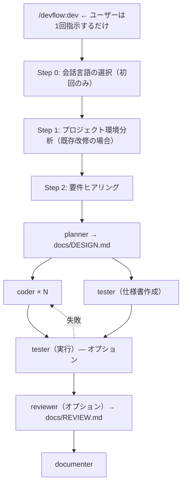

[English README](README.md)

# DevFlow

「こんなの作りたい」って伝えるだけ。設計もテストも README も、全部やっといたけど？

DevFlow は Claude Code プラグインです。5つの専門エージェントが要件ヒアリングから設計・実装・テスト・レビュー・ドキュメント生成まで自動で回します。仕様書がなくても、対話で要件を固めてから開発が始まります。

## DevFlow を使うとどうなる？

```
あなた:  /devflow:dev
        「Gemini APIを使ったチャットアプリを作りたい」

DevFlow: 日本語で進めますね。いくつか確認させてください:
         - Web UI は必要？それともCLI？
         - 会話履歴の保存は？
あなた:  Web UIで。履歴はセッション中だけでOK。

DevFlow: 了解！開発モードはどうしますか？
         1. フル開発（設計→実装→テスト→レビュー→ドキュメント）← 推奨
         4. テスト・レビューなし（爆速モード）
あなた:  急いでるので4で！

DevFlow: 爆速モードで進めます。
         → planner が設計書を作成中...
         → coder × 2 が並列で実装中...
         → documenter がドキュメント生成中...
         ✓ 完了！
```

1回の指示で、開発サイクルが自動で走ります。

## 特徴

- **対話で要件を固める** — 仕様書がなくても数問の質問で要件を整理してくれます
- **多言語対応** — TypeScript/JavaScript、Python、Go、Rust をサポートしています
- **自動検出** — プロジェクト構造、テストフレームワーク、コーディング規約を自動認識します
- **並列実行** — coder + tester を並列で実行します（coder の数はタスクに応じて動的に決定）
- **開発モード** — プロトタイプなら「テスト・レビューなし」で爆速。本番用なら全部入り
- **自動修正ループ** — テストが落ちたら coder が自動で修正して再テスト。手動の往復ゼロです
- **既存プロジェクト対応** — 変更の影響範囲を自動分析。リファクタリングも安心です
- **セキュリティチェック** — XSS、SQLインジェクション、コマンドインジェクションなどを自動検出します
- **メモリ管理** — エージェントがパターンを記録。使うほど速くなります

## インストール

[Claude Code](https://claude.com/claude-code) >= 1.0.0 が必要です。

```
/plugin marketplace add takuya-motoshima/flux
/plugin install devflow@flux
```

インストール後、**Claude Code を再起動**してエージェントを読み込みます。`/agents` で確認できます。

> [!NOTE]
> `agents: Invalid input` 等のバリデーションエラーが出る場合、プラグインキャッシュをクリアして再試行:
> ```
> rm -rf ~/.claude/plugins/cache/
> /plugin install devflow@flux
> ```

## 使い方

### カスタムコマンドで簡単実行（推奨）

```bash
/devflow:dev       # 開発開始（PM ワークフロー）
/devflow:design    # 設計作成
/devflow:review    # コードレビュー
/devflow:test      # テスト実行
/devflow:docs      # ドキュメント生成
```

### または、個別のエージェントを直接呼び出す

```
@devflow:planner    # 設計のみ
@devflow:coder      # 実装のみ
@devflow:tester     # テストのみ
@devflow:reviewer   # レビューのみ
@devflow:documenter # ドキュメント生成のみ
```

## 実行フロー



### エージェント一覧

| エージェント | 役割 | 出力 |
|------------|------|------|
| `planner` | 設計: 影響範囲分析、設計書作成 | `docs/DESIGN.md` |
| `coder` | 実装: 多言語対応コーディング | ソースコード |
| `tester` | テスト: フレームワーク自動検出、テスト実行 | `docs/TEST_SPEC.md`, `docs/TEST_REPORT.md` |
| `reviewer` | レビュー: 品質・セキュリティチェック | `docs/REVIEW.md` |
| `documenter` | ドキュメント: README、API仕様書 | `README.md`, `docs/` |

## ワークフロー詳細

### Step 0: 会話言語の選択

初回実行時に会話言語を確認し、`.claude/memory/user-preferences.md` に保存する。全エージェントがこのファイルを参照するため、質問・設計書・レビュー結果まで同じ言語で統一される

### Step 1: プロジェクト環境分析

既存プロジェクトのみ実行。以下を自動検出する:

- **マニフェスト**: 言語、フレームワーク、テストツール、ビルドシステム（`package.json`, `requirements.txt`, `go.mod`, `Cargo.toml`）
- **ディレクトリ構造**: ソースファイル、テストディレクトリ、ドキュメント
- **コーディング規約**: リンター設定（`.eslintrc`, `.prettierrc`, `pyproject.toml`）、エディタ設定

新規プロジェクトの場合はスキップし、ヒアリングに直接進む

### Step 2: 要件ヒアリング

7つの原則に従って質問する:

1. **1回の応答で質問は最大2つ** — 一度に大量の質問をしない
2. **簡単な質問から始める** — まず「何を作りたいか」を聞く
3. **段階的に深掘りする** — 1つずつ掘り下げていく
4. **文脈を理解する** — 「何を」だけでなく「なぜ」も確認する
5. **柔軟に対応する** — 明らかなことは質問せず確認するだけ
6. **冗長な質問を避ける** — 推測できる情報は聞かない
7. **「推奨で」を受け入れる** — 「推奨で」「おまかせ」と言えばベストプラクティスを即座に適用

ヒアリング後、開発モードを選択する:

| モード | パイプライン | ユースケース |
|--------|------------|-------------|
| 1. フル | 設計 → 実装 → テスト → レビュー → ドキュメント | 本番品質（推奨） |
| 2. テストなし | 設計 → 実装 → レビュー → ドキュメント | テストが既にある場合 |
| 3. レビューなし | 設計 → 実装 → テスト → ドキュメント | 内部向けコード |
| 4. 爆速 | 設計 → 実装 → ドキュメント | プロトタイプ、実験 |

### Step 3: 開発実行

エージェントは厳密なパイプラインで実行される。各ステップが完了してから次に進む:

1. **planner** が `docs/DESIGN.md` を作成し、並列化グループを推奨
2. **coder × N** + **tester Phase 1** が並列実行（実装 + テスト仕様書作成）
3. **tester Phase 2** がテスト実行。失敗時は coder が自動修正（最大3回リトライ）
4. **reviewer** がコード品質とセキュリティを分析
5. **documenter** がドキュメントを生成・更新

進捗は `.claude/memory/dev-session.md` に記録される。長時間セッションでコンテキスト圧縮が発生した場合、このファイルから自動的に状態を復帰する

## エージェント詳細

### planner

要件を実装タスクに分解し、設計書を作成する

- **専門領域**: タスクの依存関係分析、影響範囲の特定、並列化グループの推奨
- **出力**: `docs/DESIGN.md`（概要、影響範囲、技術スタック、ファイル構成の固定構造）
- **特徴**: どのタスクが並列実行可能かを判断し、coder の配分を最適化する

### coder

割り当てられたタスクをプロジェクトの規約に従って実装する

- **専門領域**: 多言語対応（TypeScript/JavaScript, Python, Go, Rust）、コーディング規約の自動検出
- **コーディング規約**: 関数20-30行以内、型安全性、各言語のリンター準拠
- **特徴**: 1行のコードを書く前に既存コードのスタイル（命名規則、インデント、パターン）を読み取る。1インスタンス1タスク — スコープの肥大化なし

### tester

テスト仕様書の作成とテスト実行を2フェーズで行う

- **専門領域**: フレームワーク自動検出 — Vitest, Jest, Mocha, pytest, Go testing, cargo test
- **Phase 1**（coder と並列）: `docs/TEST_SPEC.md` を作成（テストカテゴリ: 正常系、異常系、境界値）
- **Phase 2**（coder 完了後）: テストコードを実装、テスト実行、`docs/TEST_REPORT.md` を作成（サマリ、カバレッジ、カテゴリ別結果）
- **特徴**: 実装コードは変更しない。結果を報告し、修正は coder が担当する

### reviewer

コード品質とセキュリティをレビューする。**読み取り専用** — ソースコードを変更できない

- **専門領域**: 可読性、保守性、型安全性、セキュリティ、パフォーマンス
- **セキュリティチェック**: XSS, SQLインジェクション, コマンドインジェクション, CSRF, 秘密鍵漏洩, パストラバーサル。さらに言語固有のチェック（JSのプロトタイプ汚染、Pythonのpickleデシリアライゼーション、Goのレースコンディション、Rustのunsafeブロック）
- **出力**: `docs/REVIEW.md`（スコア付き総評、Critical/Warning/Good の指摘事項、セキュリティチェックリスト）
- **特徴**: 確信度の高い問題のみ報告する。問題だけでなく良いコードも指摘する

### documenter

プロジェクトドキュメントを生成・更新する。**ソースコード変更不可** — `.md` と `.yaml` ファイルのみ編集

- **専門領域**: README 自動生成、条件付きの API 仕様書・アーキテクチャドキュメント
- **条件付き出力**:
  - `docs/ARCHITECTURE.md` — マルチサービス/マルチレイヤーのプロジェクトのみ
  - API仕様書（OpenAPI 3.0） — HTTP API エンドポイントがある場合のみ
  - CLI ツール、ライブラリ、単一モジュールのプロジェクトではスキップ
- **特徴**: README と DESIGN.md の内容重複を避ける。README は使い方、DESIGN.md は設計をカバーする

## 出力例

### 要件ヒアリング

```
あなた:  /devflow:dev
        「タスク管理のREST APIを作りたい」

DevFlow: タスク管理のREST APIですね。2つ確認させてください:
         - 言語/フレームワークは決まっていますか？（Express, FastAPI, Gin 等）
         - ユーザー認証は必要ですか？
あなた:  Express + TypeScript。認証はJWTで。

DevFlow: 了解です。もう1つ:
         - データベースは必要ですか？必要なら何を使いますか？
あなた:  PostgreSQL + Prisma で。

DevFlow: 理解した内容をまとめます:
         - Express + TypeScript の REST API
         - JWT認証（ユーザー登録・ログイン）
         - PostgreSQL + Prisma ORM
         - タスクのCRUD操作

         開発モードはどうしますか？
         1. フル開発（設計→実装→テスト→レビュー→ドキュメント）← 推奨
         2. テストなし
         3. レビューなし
         4. テスト・レビューなし
```

### docs/DESIGN.md

```markdown
## 概要
JWT認証付きのタスク管理REST API。
ユーザーは登録・ログインし、個人のタスクをRESTfulエンドポイントで管理できる。

## 影響範囲
- 新規: src/routes/, src/middleware/auth.ts, prisma/schema.prisma
- 変更: なし（新規プロジェクト）

## 技術スタック
- ランタイム: Node.js + TypeScript
- フレームワーク: Express
- ORM: Prisma
- DB: PostgreSQL
- 認証: JWT (jsonwebtoken)

## ファイル構成
src/
├── routes/
│   ├── tasks.ts
│   └── auth.ts
├── middleware/
│   └── auth.ts
├── prisma/
│   └── schema.prisma
└── index.ts
```

### docs/REVIEW.md

```markdown
## 総評
スコア: 8/10
TypeScript の型が適切に使われた、整理されたExpress API。エラーハンドリングも一貫している。

## 指摘事項
### Critical
- [src/middleware/auth.ts:15] JWTシークレットがハードコードされている。環境変数に移行すること。

### Warning
- [src/routes/tasks.ts:42] リクエストボディの入力バリデーションが不足。
  zodまたはjoiでスキーマバリデーションを追加する。

### Good
- 全ルートで一貫したエラーハンドリングパターン
- Prisma型の適切な使用 — `any` の使用なし

## セキュリティチェック
- [x] SQLインジェクション: Prisma ORMで防御済み
- [x] CSRF: トークンベース認証、Cookie セッションなし
- [ ] 環境変数: JWTシークレットがハードコード（上記Critical参照）
- [ ] 入力バリデーション: 2エンドポイントで不足
```

## こんなときに使う / 使わない

**DevFlow を使う:**
- 新規プロジェクトをゼロから立ち上げるとき
- 複数ファイルにまたがる機能追加
- 仕様が曖昧で、要件を整理しながら進めたいとき
- 既存プロジェクトのリファクタリング（影響範囲を自動分析）
- 設計・テスト・レビュー・ドキュメントまで一気に仕上げたいとき

**DevFlow を使わない:**
- 1行のバグ修正やタイポ修正
- 仕様が完全に決まっている単純なタスク
- 緊急のホットフィックス（ヒアリングのステップが不要な場合）
- 個別の作業 — テストだけなら `/devflow:test`、レビューだけなら `/devflow:review`、ドキュメントだけなら `/devflow:docs` を直接使う方が早い

## ベストプラクティス

1. **フル開発モードを基本にする** — テストとレビューをスキップすると品質が落ちる。プロトタイプや実験の場合のみモード4を使う
2. **ヒアリングで「推奨で」を活用する** — 技術選定に迷ったら「推奨で」と答えるだけでベストプラクティスが適用される
3. **既存プロジェクトでは変更目的を明確に伝える** — 「認証を追加」より「JWT認証を追加してユーザー登録・ログインAPIを実装」の方が精度が上がる
4. **レビュー結果は次のセッションに活きる** — reviewer の指摘パターンはメモリに記録され、次回の coder が同じミスを避ける
5. **個別コマンドも使いこなす** — テストだけ再実行したいなら `/devflow:test`、レビューだけなら `/devflow:review`、ドキュメントだけなら `/devflow:docs` がフルパイプラインより効率的

## Hooks

エージェントの開始・終了時に SubagentStart/Stop フックで通知されます。

デフォルトではターミナルに通知を表示します。`hooks/hooks.json` をカスタマイズして Slack webhook やログ記録などを追加できます。

## アンインストール

```
/plugin uninstall devflow@flux
```

## アップデート

```
rm -rf ~/.claude/plugins/cache/
cd ~/.claude/plugins/marketplaces/flux && git pull
```

アップデート後は Claude Code を再起動してください。

## 関連リンク

- [Claude Code プラグイン](https://code.claude.com/docs/ja/plugins)
- [プラグインマーケットプレイス](https://code.claude.com/docs/ja/plugin-marketplaces)
- [サブエージェント](https://code.claude.com/docs/ja/sub-agents)
- [プラグインリファレンス](https://code.claude.com/docs/ja/plugins-reference)

## ライセンス

MIT

## 著者

Takuya Motoshima ([@takuya-motoshima](https://github.com/takuya-motoshima)) / [X](https://x.com/takuya_motech)
