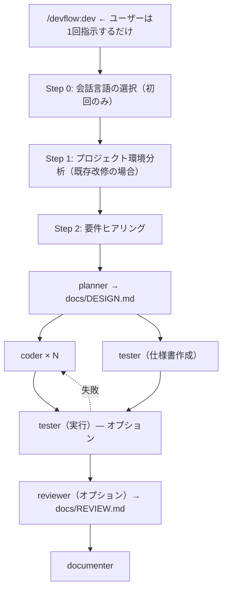

[English README](README.md)

# DevFlow

「こんなの作りたい」って伝えるだけ。設計もテストも README も、全部やっといたけど？

「プロジェクト多すぎて手が回らない...全部AIに任せられないかな」— そう思って作った。
今は DevFlow に任せて、1人で4つのプロジェクトを並行で回してる。

DevFlow は5つの専門エージェントが設計からドキュメントまで自動で仕上げる Claude Code プラグインです。
要件のヒアリングから始まるので、仕様書がなくても大丈夫です。

## DevFlow を使うとどうなる？

```
あなた:  /devflow:dev
        「Gemini APIを使ったチャットアプリを作りたい」

DevFlow: 日本語で進めますね。いくつか確認させてください:
         - Web UI は必要？それともCLI？
         - 会話履歴の保存は？
あなた:  Web UIで。履歴はセッション中だけでOK。

DevFlow: 了解！開発モードはどうしますか？
         1. フル開発（設計→実装→テスト→レビュー→ドキュメント）← 推奨
         4. テスト・レビューなし（爆速モード）
あなた:  急いでるので4で！

DevFlow: 爆速モードで進めます。
         → planner が設計書を作成中...
         → coder × 2 が並列で実装中...
         → documenter がドキュメント生成中...
         ✓ 完了！
```

1回の指示で、開発サイクルが自動で走ります。

## 特徴

- **対話で要件を固める** — 仕様書がなくても数問の質問で要件を整理してくれます
- **多言語対応** — TypeScript/JavaScript、Python、Go、Rust をサポートしています
- **自動検出** — プロジェクト構造、テストフレームワーク、コーディング規約を自動認識します
- **並列実行** — coder + tester を並列で実行します（coder の数はタスクに応じて動的に決定）
- **開発モード** — プロトタイプなら「テスト・レビューなし」で爆速。本番用なら全部入り
- **自動修正ループ** — テストが落ちたら coder が自動で修正して再テスト。手動の往復ゼロです
- **既存プロジェクト対応** — 変更の影響範囲を自動分析。リファクタリングも安心です
- **セキュリティチェック** — XSS、SQLインジェクション、コマンドインジェクションなどを自動検出します
- **メモリ管理** — エージェントがパターンを記録。使うほど速くなります

## インストール

[Claude Code](https://claude.com/claude-code) >= 1.0.0 が必要です。

```
/plugin marketplace add takuya-motoshima/flux
/plugin install devflow@flux
```

インストール後、**Claude Code を再起動**してエージェントを読み込みます。`/agents` で確認できます。

> [!NOTE]
> `agents: Invalid input` 等のバリデーションエラーが出る場合、プラグインキャッシュをクリアして再試行:
> ```
> rm -rf ~/.claude/plugins/cache/
> /plugin install devflow@flux
> ```

## 使い方

### カスタムコマンドで簡単実行（推奨）

```bash
/devflow:dev       # 開発開始（PM ワークフロー）
/devflow:design    # 設計作成
/devflow:review    # コードレビュー
/devflow:test      # テスト実行
/devflow:docs      # ドキュメント生成
```

### または、個別のエージェントを直接呼び出す

```
@devflow:planner    # 設計のみ
@devflow:coder      # 実装のみ
@devflow:tester     # テストのみ
@devflow:reviewer   # レビューのみ
@devflow:documenter # ドキュメント生成のみ
```

## 実行フロー



### エージェント一覧

| エージェント | 役割 | 出力 |
|------------|------|------|
| `planner` | 設計: 影響範囲分析、設計書作成 | `docs/DESIGN.md` |
| `coder` | 実装: 多言語対応コーディング | ソースコード |
| `tester` | テスト: フレームワーク自動検出、テスト実行 | `docs/TEST_SPEC.md`, `docs/TEST_REPORT.md` |
| `reviewer` | レビュー: 品質・セキュリティチェック | `docs/REVIEW.md` |
| `documenter` | ドキュメント: README、API仕様書 | `README.md`, `docs/` |

## Hooks

エージェントの開始・終了時に SubagentStart/Stop フックで通知されます。

デフォルトではターミナルに通知を表示します。`hooks/hooks.json` をカスタマイズして Slack webhook やログ記録などを追加できます。

## アンインストール

```
/plugin uninstall devflow@flux
```

## アップデート

```
rm -rf ~/.claude/plugins/cache/
cd ~/.claude/plugins/marketplaces/flux && git pull
```

アップデート後は Claude Code を再起動してください。

## 関連リンク

- [Claude Code プラグイン](https://code.claude.com/docs/ja/plugins)
- [プラグインマーケットプレイス](https://code.claude.com/docs/ja/plugin-marketplaces)
- [サブエージェント](https://code.claude.com/docs/ja/sub-agents)
- [プラグインリファレンス](https://code.claude.com/docs/ja/plugins-reference)

## ライセンス

MIT

## 著者

Takuya Motoshima ([@takuya-motoshima](https://github.com/takuya-motoshima)) / [X](https://x.com/takuya_motech)
