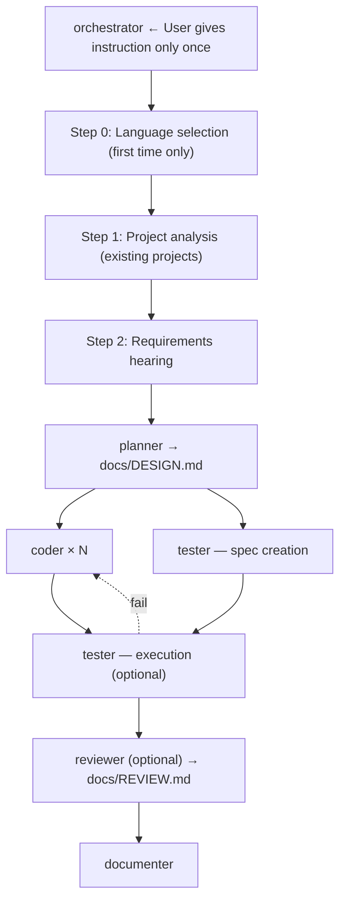

[日本語版はこちら](README.ja.md)

# DevFlow

Just say what you want to build. Design, tests, README — done. You're welcome.

"Too many projects, not enough hands... can't AI just handle everything?" — That's why I built this.
Now I let DevFlow handle the work while I juggle 4 projects in parallel.

DevFlow is a Claude Code plugin where 6 specialized agents handle everything from design to documentation automatically.
It starts with a requirements hearing, so you don't even need a spec doc.

## What happens when you run DevFlow?

```
You:     /devflow:dev
         "I want to build a chat app using Gemini API"

DevFlow: I'll proceed in English. Let me ask a few questions:
         - Do you need a Web UI or CLI?
         - Should conversation history be saved?
You:     Web UI. Session-only history is fine.

DevFlow: Got it! Which development mode?
         1. Full (design → code → test → review → docs) ← recommended
         4. No test, no review (speed mode)
You:     In a hurry, go with 4!

DevFlow: Speed mode it is.
         → planner creating design doc...
         → coder × 2 implementing in parallel...
         → documenter generating docs...
         ✓ Done!
```

One instruction, and the entire development cycle runs automatically.

## Features

- **Conversational requirements** — A few questions to clarify what you need. No spec doc required.
- **Multi-language** — TypeScript/JavaScript, Python, Go, and Rust supported.
- **Auto-detection** — Automatically recognizes project structure, test frameworks, and coding standards.
- **Parallel execution** — coder + tester run in parallel (number of coders scales dynamically per task).
- **Development modes** — Skip tests and reviews for rapid prototyping. Or go full pipeline for production.
- **Auto-fix loop** — Tests fail? coder automatically fixes the code and retests. Zero manual back-and-forth.
- **Existing project support** — Automatically analyzes impact scope of changes. Refactoring made safe.
- **Security checks** — Automatically detects XSS, SQL injection, command injection, and more.
- **Memory** — Agents record patterns. Gets faster the more you use it.

## Installation

[Claude Code](https://claude.com/claude-code) >= 1.0.0 required.

```
/plugin marketplace add takuya-motoshima/flux
/plugin install devflow@flux
```

After installation, **restart Claude Code** to load the agents. Verify with `/agents`.

> [!NOTE]
> If you get validation errors like `agents: Invalid input`, clear the plugin cache and retry:
> ```
> rm -rf ~/.claude/plugins/cache/
> /plugin install devflow@flux
> ```

## Usage

### Custom Commands (Recommended)

```bash
/devflow:dev       # Start development (launch orchestrator)
/devflow:design    # Create design
/devflow:review    # Code review
/devflow:test      # Run tests
/devflow:docs      # Generate documentation
```

### Or, specify an agent directly

```
@devflow:orchestrator
I want to build a chat app using Gemini API
```

You can also call individual agents directly:

```
@devflow:planner    # Design only
@devflow:coder      # Implementation only
@devflow:tester     # Testing only
@devflow:reviewer   # Review only
@devflow:documenter # Documentation only
```

## Execution Flow



### Agents

| Agent | Role | Output |
|-------|------|--------|
| `orchestrator` | PM: requirements hearing, dev flow management | - |
| `planner` | Designer: impact analysis, design creation | `docs/DESIGN.md` |
| `coder` | Developer: multi-language implementation | Source code |
| `tester` | Tester: framework auto-detection, test execution | Test code |
| `reviewer` | Reviewer: quality & security checks | `docs/REVIEW.md` |
| `documenter` | Documenter: README, API specs | `README.md`, `docs/` |

## Hooks

Agents notify you on start/stop via SubagentStart/Stop hooks.

By default, notifications are displayed in the terminal. Customize `hooks/hooks.json` to add Slack webhooks, logging, etc.

## Uninstall

```
/plugin uninstall devflow@flux
```

## Update

```
rm -rf ~/.claude/plugins/cache/
cd ~/.claude/plugins/marketplaces/flux && git pull
```

Restart Claude Code after updating.

## Related Links

- [Claude Code Plugins](https://code.claude.com/docs/en/plugins)
- [Plugin Marketplace](https://code.claude.com/docs/en/plugin-marketplaces)
- [Sub-agents](https://code.claude.com/docs/en/sub-agents)
- [Plugin Reference](https://code.claude.com/docs/en/plugins-reference)

## License

MIT

## Author

Takuya Motoshima ([@takuya-motoshima](https://github.com/takuya-motoshima))
